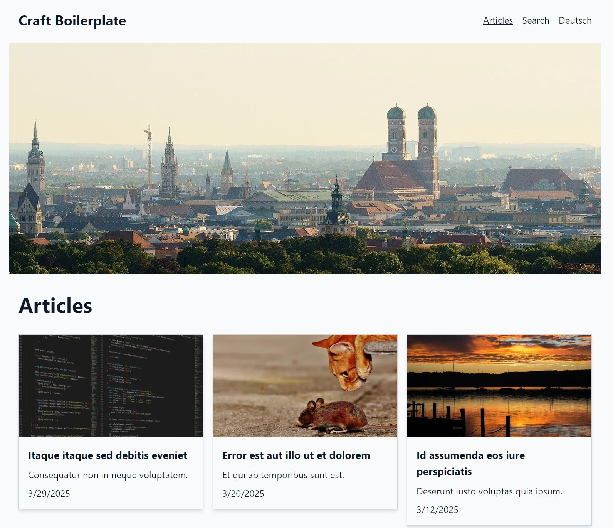

# Craft 5 Boilerplate

This is the result of a web development workshop series with the goal to create a simple boilerplate from scratch.



While basic knowledge of HTML/CSS was assumed, the focus was on

* Principles of a CMS
* Creating a simple content model
* Setting up a multilingual site (english/german)
* Using a well-structured template system
* Creating dynamic markup
* Creating a responsive design
* Using a modern build pipeline for assets

Not all of these topics are covered in detail, but we tried to give a good overview of the possibilities.

Not in focus:

* Building a fancy design (yes, it is a bit boring...)
* Custom fonts
* Performance optimization
* Perfect image handling
* SEO
* Tailwind CSS customizations
* Setting up a local development environment/IDE, this was prepared in advance.

## Starting point

Started with a pure Craft CMS starter as provided in the craftcms/craft package with 
the following additions:

* Set system timezone to Europe/Berlin
* Use a single `.env.example` file for all environments
* Use environment specific config settings in config/general.php, dependent on CRAFT_ENVIRONMENT variable
* Added more config settings to config/general.php
* Added modules/faux to enable autocompletion for some most frequently used variables in twig. See [modules/faux/README.md](modules/faux/README.md) for details.
* Added /web/cpresources, /node_modules, /config/license.key to .gitignore
* Added setup/install for automated installation under ddev, creates a user with user defined username/password.

## Boilerplate

* Added Vite powered asset pipeline with Tailwind CSS 4 and Alpine JS 3
* Setup 2 sites (english/german)
* Added local file systems and image volume
* Added basic sections and fields, including a simple matrix content builder
* Added basic templates
* Added basic image handling include
* Added mobile navigation via Alpine JS
* Added search
* Customized Control Panel (sources, preview targets.)
* Added german translations
* Added seed controller and example images to create dummy content
* Store all files that can be dynamically recreate in a single /web/dist directory (CP resources, Vite assets, image transforms)
* Prepared prettier config including .twig files

We tried to add a lot of comments to the code, so you can easily follow along.

## DDEV Installation

* Clone repository
* `cd` into project directory
* Run `bash setup/install <projectname> <username> <password>`

`bash` just executes the script without it having execute permissions.

If that's not available on your system, just run the commands in the script manually.

NOTE: 1.3.0+ requires DDEV 1.24.6+. If you are using an older version, you can use the `1.2.0` tag, or run the setup manually.

### Seed content

* Some images are included (Copyright Pixabay). If you want to use your own images, you can replace them, min. 1024px wide.
* Run `ddev craft seed` to create some dummy content
* If you want to start with your own content, update the `Settings/Singles` sections with your own content.
* If you don't want a multi-site setup, remove the second site in `Settings/Sites`.

## Non-DDEV Installation

Untested...

* Clone repository
* `cd` into project directory
* Prepare web server and database according to Craft CMS requirements
* Manually follow the steps in setup/install

## Plugins

* Uses [Vite plugin](https://plugins.craftcms.com/vite?craft5) by nystudio107 for building assets.
* No additional Craft CMS plugins are used, but you can add them as needed.
* Used the [fakerphp/faker package](https://github.com/fakerphp/faker) to create dummy content.

## Building assets

* Run `ddev npm run build` to build assets for production
* Run `ddev npm run dev` to build assets for development with instant reloading

### Used packages

* [@tailwindcss/vite Tailwind 4](https://tailwindcss.com/docs/installation/using-vite) for styling. This also installs Vite as a dependency.
* [@tailwindcss/typography](https://github.com/tailwindlabs/tailwindcss-typography) and [@tailwindcss/forms](https://github.com/tailwindlabs/tailwindcss-forms) plugins.
* [Alpine JS 3](https://alpinejs.dev/start-here) for interactivity. Only used for the mobile navigation.
* [@alpinejs/focus](https://alpinejs.dev/plugins/focus) for focus/keyboard handling inside the mobile navigation.

## Prettier

Added prettier config for formatting code including `.twig` files.

This does nothing out of the box, until

* You configure your IDE to use it. See [docs for PhpStorm](https://www.jetbrains.com/help/phpstorm/prettier.html#ws_prettier_configure).
* You run `ddev npm run prettier-templates` or `ddev npm run prettier-modules` to format files in `templates` or `modules` directory.

## Matrix vs CKEditor

We use a simple matrix field for content instead of CKEditor. 

Personal preference aside, the main reason for this is that we want to keep content for different languages in sync.

* Enforce that all languages have the same sequence of content blocks
* Enforce that untranslatable content like images or styling options are in sync

However, you may want to replace the plaintext field in the text matrix block with a CKEditor field, 
especially if you want to apply simple formating as bold/italic or create links to other entries.

Take these steps:

* Install the CKEditor plugin: `ddev composer require "craftcms/ckeditor:^4.6.0" -w && ddev craft plugin/install ckeditor`
* Edit the `Text` entry type
* Add new field with  
* * name `Rich Text`, 
* * handle `richText`, 
* * field type `CKEditor`, 
* * translation method `Translate for each languge`,
* * CKEditor config: `Simple` (or add your own)
* Save the entry type (with both the old and the new field)
* Run `ddev craft resave/entries --type=text --site=* --set=richText --to="={text|md}"` to migrate the content from the old field to the new field
* Remove the old field from the entry type
* Edit `templates/_partials/entry/text.twig` and replace `{{ entry.text|... }}` with `{{ entry.richText }}`
* Edit the used CKEditor config. Recommended:
* * Toolbar: Bold, Italic, Bulleted List, Numbered List, Link
* * Uncheck heading levels 1-6
* * Config options (JSON): See [docs](https://github.com/craftcms/ckeditor?tab=readme-ov-file#examples) for more options.
```json
{
  "link": {
    "decorators": {
      "openInNewTab": {
        "attributes": {
          "rel": "noopener noreferrer",
          "target": "_blank"
        },
        "label": "Open in new tab?",
        "mode": "manual"
      }
    }
  },
  "list": {
    "properties": {
      "reversed": true,
      "startIndex": true,
      "styles": false
    }
  }
}
```

## Props

Thanks to Aylin, Karla, Lucy, Lori, Moni.